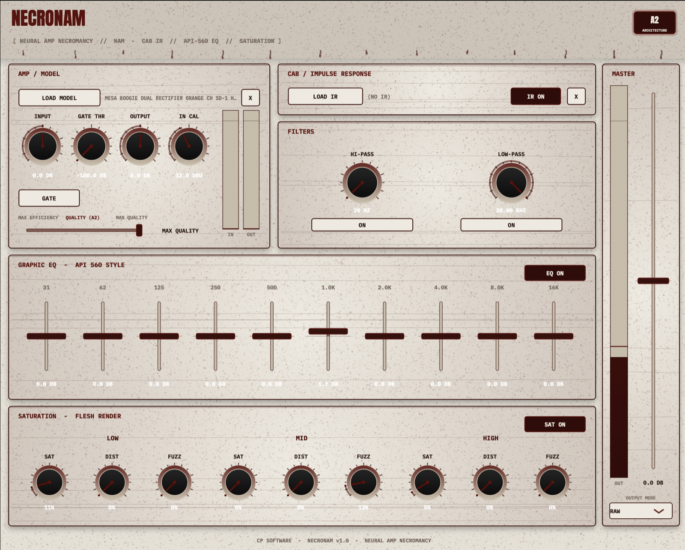

# NECRONAM MAX v2 — Neural Amp Necromancy (feature-loaded edition)



A horror-themed **dual-amp Neural Amp Modeler (NAM) capture player** by CP
Software, built with JUCE — the feature-loaded sibling of
[NECRONAM](https://github.com/collinp2/cp_software/tree/necronam). v2 is a full
pedalboard-and-rack rig: switchable **drive circuits**, two **Flesh Render
multiband saturators** with **sweepable crossovers**, dual NAM amps with a
**dual-mono stereo input mode**, power-amp **sag**, a stereo dual-IR cab, an
API-560 graphic EQ, an **LA-2A style compressor**, **plate/spring reverb** +
delay, a clean DI blend, and a bass-capable **strobe tuner**.

> NECRONAM MAX is a **separate plugin** from NECRONAM (distinct name, plugin
> code and bundle id). Install both and use whichever fits the session.

## Signal chain (strict — the UI tabs follow it)

```
MASTER INPUT LEVEL   (master strip, visible on every page, with IN meter)
  → noise gate       (keyed from this direct signal; gain applied PRE or POST
                      amp via the Position switch)
  → FLESH RENDER PRE (multiband saturation, sweepable crossovers)
  → DRIVE            (switchable circuit: TC-style integrated preamp with
                      Gain/Bass/Mid/Treble/Level, or generic Tube Screamer
                      with Drive/Tone/Level)
  → LOW CUT
  → DUAL NAM AMPS    mono:   Single / Series / Parallel (+ Spread)
                     stereo: dual mono — L → Amp A, R → Amp B, hard panned
  → SAG              (tube power-amp sag, 0 = none .. 10 = extreme)
  → CAB IR           mono:   dual-IR mixer on the stereo bus
                     stereo: Cab A → left only, Cab B → right only
  → API-560 GRAPHIC EQ
  → FLESH RENDER POST (stereo, sweepable crossovers)
  → LA-2A COMPRESSOR (Peak Reduction + Gain, GR meter)
  → hi-pass / low-pass filters
  → DELAY + REVERB   (order-switchable; reverb = Plate or Spring; true-bypass)
  → CLEAN DI BLEND
  → MASTER OUTPUT    (Raw / Normalized / Calibrated)

TUNER: taps the direct input; engaging it mutes the output.
```

**Tabs:** `PRE` → `AMP / CAB` → `POST` → `FX` → `TUNER`, in chain order. The
editor always opens on **AMP / CAB**. The **master strip** (input level + IN
meter, output fader + meter, clean blend, output mode) is visible on every tab.

**SOLO AMP/CAB** (tab bar, lights up vivid red): temporarily bypasses every
effect module — gate, saturation, drive, low cut, EQ, compressor, filters,
delay, reverb — leaving just amps → sag → cab, so you can audition the raw
rig. The other tabs grey out while it's engaged.

## Stereo input mode (dual mono)

`Input Mode: Stereo (Dual Mono)` turns the plugin into **two independent
rigs**: the left input feeds **Amp A → Cab A → left output** and the right
input feeds **Amp B → Cab B → right output**, hard panned. Send two separate DI
tracks in and get a unique amp + cab on each side. The whole pre chain (gate,
saturation, drive, low cut) also runs per channel. In **Mono** mode the input
is summed and the classic Single / Series / Parallel routing (+ Spread) applies.

## Amp & cab utilities — On / Ø / M / ALIGN

Every amp and cab slot has four utilities:

- **On** — bypass. The block is routed around (Series: signal passes straight
  to the next stage; Parallel: the branch drops out and the survivor
  re-centres).
- **Ø** — polarity invert.
- **M** — mute, a true **kill switch** (lights vivid red): an engaged-but-muted
  block outputs silence at its point in the chain — a muted sole cab means
  silence, not dry.
- **ALIGN** — a 0–5 ms micro-delay on the branch for phase alignment. Use it
  (with Ø) to fix comb filtering when blending parallel amps or two cab IRs.

The master strip's **Clean Blend** has a matching **DI ALIGN** knob that delays
the clean DI to line up with the wet path (cab IRs carry a few ms of
mic-distance onset delay) — kills the combing in clean blends, especially on
bass.

## Drive section

One circuit at a time (a true switch, not a blend):

- **TC Preamp** — inspired by the TC Electronic Integrated Preamplifier: a very
  clean FET front end that only folds over at extreme gain, plus an active
  Bass / Mid / Treble EQ and Level. Transparent, punchy colour.
- **Tube Screamer** — the generic TS topology: the full-range signal passes at
  unity into a symmetric soft clipper while only the content above ~720 Hz
  (first-order, like the real RC) gets the drive boost — the classic mid-hump.
  The level compensation is frequency-aware, so the unity-gain low end stays
  at full strength no matter the drive (bass-friendly, unlike a stock TS clone
  whose auto-levelling eats the bottom). Tone (treble roll-off) and Level.

## Flesh Render — front and output

The multiband saturator appears **twice** (PRE, mono per lane; POST, stereo).
v2 adds **sweepable crossovers** (X-LOW 60–800 Hz, X-HIGH 800 Hz–8 kHz) and
revoices the three stages to be *realistic*:

- **SAT** — tape / transformer saturation: soft tanh compression with gentle
  even harmonics.
- **DRIVE** — plain soft clipping (arctangent): smooth odd-harmonic overdrive.
- **FUZZ** — Big Muff style: two cascaded high-gain clipping stages, heavily
  sustained.

All three are level-compensated, so engaging a stage doesn't jump the volume.
Each Flesh Render also has a **MIX** knob (wet/dry) for parallel, NY-style
saturation — keep the clean body underneath and blend the grit in on top.

## Sag

A power-amp sag simulation sits **immediately before the cab**: an envelope
with a deliberately slow attack droops the gain as you dig in (transients punch
through, notes bloom on release). `0` = none, `10` = extreme brown-out squish.
Linked across channels in mono mode, independent per side in stereo mode.

## LA-2A style compressor

After the post Flesh Render, before the final filters. The traditional
two-knob front panel: **Peak Reduction** (drives the threshold into a soft
~3:1 knee) and **Gain** (manual make-up, 0..+24 dB). Program-dependent
two-stage optical release, stereo-linked, with a **gain-reduction meter**.

## Reverb & delay

End-of-chain stereo delay (time / feedback / mix) and reverb with a **Plate /
Spring** type switch — plate is a dense tuned algorithm, spring is a modelled
tank (band-passed drive into a dispersive modulated feedback loop — it boings).
The **FX Order** selector swaps delay↔reverb. Every FX module is
**true-bypassed**: skipped entirely and state-reset while off.

## Gate

The detector is **always keyed from the direct pre-amp signal**, and the
**Position** switch chooses where the computed gain is applied: `Pre Amp`
(classic, before the front end) or `Post Amp` (slams the amp's hiss too, while
still tracking your dry playing).

The **RELEASE** knob (0.1 ms – 500 ms) drives both the gain close time and the
detector decay: at the minimum the gate slams shut within a few samples —
lightning-fast, full modern-metal stutter. Built-in hysteresis (the close
threshold sits 6 dB under the open threshold) keeps the fastest settings from
chattering.

## Strobe tuner (guitar AND bass)

v2 replaces the detector with **YIN** (cumulative-mean normalised difference,
first-dip threshold) over a decimated analysis window — the standard
anti-octave-error tuner algorithm — with range down to **25 Hz** (5-string low
B and drop tunings included), plus median smoothing, note hysteresis and
dropout hold so the reading snaps and stays. Engaging the tuner mutes the
output.

## Presets

The preset bar stores the **whole plugin state** (all parameters plus the
loaded model/IR file paths) as XML under:

```
~/Library/Application Support/CP Software/NECRONAM MAX/Presets   (macOS)
<userAppData>/CP Software/NECRONAM MAX/Presets                  (other)
```

Presets reference the `.nam` and `.wav` files by path — keep those files in
place to recall a tone. The `< >` buttons beside each amp's Load button scroll
through the `.nam` files in that amp's current folder.

## Output modes

Referenced to **Amp A**'s model metadata (lane B uses Amp B's input calibration
in stereo mode):

- **Raw** — output gain only.
- **Normalized** — targets ~−18 dBFS using the model's embedded loudness.
- **Calibrated** — reproduces real-world levels using the model's input/output
  dBu calibration and your interface's input-calibration value ("IN CAL").

## Building

Requires CMake (≥ 3.21) and a C++20 compiler. JUCE and NeuralAmpModelerCore are
fetched automatically via `FetchContent` (first configure needs network).

```bash
cmake -B build -DCMAKE_BUILD_TYPE=Release
cmake --build build --config Release
```

Faster local dev build: `-DCMAKE_OSX_ARCHITECTURES=arm64`. On **macOS 15** JUCE
is pinned to the `develop` branch (per the CP Software build notes).

Formats: **VST3**, **AU**, **Standalone**; `COPY_PLUGIN_AFTER_BUILD` installs
into `/Library/Audio/Plug-Ins/...` on macOS. Release installers for macOS +
Windows are built by CI on a `necronam-max-v*` tag (see `packaging/README.md`).

## Project layout

| File | Purpose |
|------|---------|
| `CMakeLists.txt` | Build config; fetches JUCE + NeuralAmpModelerCore |
| `Source/PluginProcessor.*` | Engine: strict chain, dual amps, stereo mode, params, state |
| `Source/PluginEditor.*` | Tabbed UI (PRE / AMP-CAB / POST / FX / TUNER) + master strip |
| `Source/DriveCircuits.h` | TC-preamp + Tube Screamer drive models |
| `Source/SagProcessor.h` | Power-amp sag |
| `Source/OptoCompressor.h` | One-knob LA-2A style compressor + GR tap |
| `Source/SpringReverb.h` | Spring reverb tank model |
| `Source/Saturation.h` | Flesh Render multiband saturator (sweepable, v2 curves) |
| `Source/PitchDetector.h` | YIN pitch tracker (bass-capable) |
| `Source/StrobeTuner.h` | Strobe display (median/hysteresis/hold) |
| `Source/PresetManager.h` | On-disk preset browser |
| `Source/ResamplingNAM.h` | NAM wrapper with on-demand sample-rate conversion |
| `Source/Api560EQ.h` | 10-band proportional-Q graphic EQ |
| `Source/HorrorLookAndFeel.*` | CP Software blood/bone theme |

## Credits / sources

- Neural Amp Modeler core & plugin — Steven Atkinson
  (`sdatkinson/NeuralAmpModelerCore`, `NeuralAmpModelerPlugin`), MIT.
- Saturation DSP & horror theme — CP Software "Flesh Render".
- Framework — JUCE.
