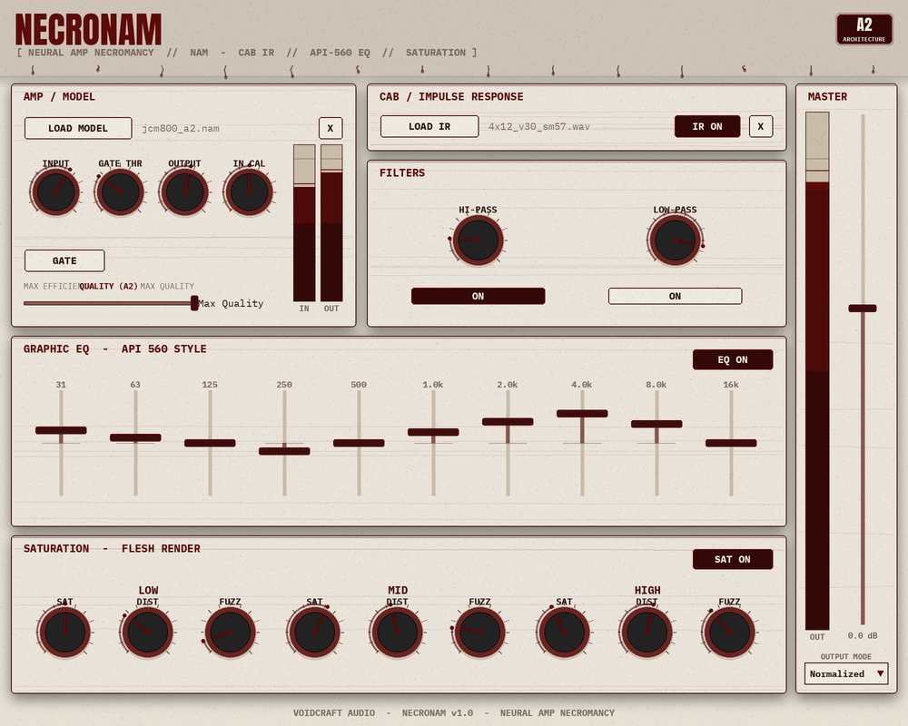

# NECRONAM — Neural Amp Necromancy



> Preview is a static mockup rendered from the editor's layout + theme, not a
> screenshot of a running build.

A horror-themed **Neural Amp Modeler (NAM) capture player** by CP Software,
built with JUCE. It does everything the official NAM ("gateway") plugin does —
loads `.nam` captures, runs a noise gate, loads cab impulse responses, and
handles output calibration — then adds a **post chain**: an **API-560 style
graphic EQ**, **hi-pass / low-pass filters**, and the **Flesh Render multiband
saturator** (saturation / distortion / fuzz).

Built to share the visual language of the existing CP Software horror line
(Flesh Render): blood-red / bone palette, claw-tick knobs, grain + blood-drip
decoration.

> This is a **new** plugin. It does not modify the existing Flesh Render or
> GEQ-12 projects.

## Signal chain

```
input gain
  → noise gate (trigger)
  → NAM model            (resampled to/from the model's native rate)
  → noise gate (gain)
  → NAM output trim      (module output level, shown on the OUT meter)
  → cab IR               (optional)
  → DC blocker (~5 Hz)
  → API-560 graphic EQ   (optional, 10 octave bands ±12 dB, proportional Q)
  → multiband saturation (optional, Flesh Render: sat → dist → fuzz, 3 bands)
  → hi-pass filter       (optional)
  → low-pass filter      (optional)
  → output (Raw / Normalized / Calibrated)
```

The amp path is mono (NAM and cab IRs are mono); the processed signal is fanned
out to all output channels.

## Metering

Three peak meters (peak-hold, ~30 Hz):

- **IN** / **OUT** in the Amp panel — the NAM module's input (post input gain,
  i.e. what the model sees — useful since NAM models are level-sensitive) and
  output.
- **MASTER** in the right-hand output strip — the whole-plugin output, next to
  the master level fader and output-mode selector.

Peaks are accumulated on the audio thread (lock-free) and read+reset by the
editor; the over-0 dBFS portion of each bar lights up as a clip warning.

## Low latency

Latency is **zero** whenever the loaded model's native sample rate matches the
session sample rate (the common case). The only latency source is the
sample-rate converter (`ResamplingContainer`, Lanczos), which engages **only**
when the model's rate differs from the host's; that group delay is reported to
the host via `setLatencySamples()`. The EQ, filters and saturator are
minimum-phase IIR / per-sample waveshapers and add no latency (the saturator is
not oversampled, matching Flesh Render — extreme drive can alias on bright
material).

## Building

Requires CMake (≥ 3.21) and a C++20 compiler. JUCE and NeuralAmpModelerCore
(with its Eigen / AudioDSPTools submodules) are fetched automatically via
`FetchContent`, so the first configure needs network access and takes a while.

```bash
cmake -B build -DCMAKE_BUILD_TYPE=Release
cmake --build build --config Release
```

On **macOS 15** JUCE is pinned to the `develop` branch (per the CP Software build
notes) to avoid removed-API issues.

Formats built: **VST3**, **AU**, **Standalone**. With `COPY_PLUGIN_AFTER_BUILD`
on, the VST3/AU are copied into your user plug-in folders automatically.

## Project layout

| File | Purpose |
|------|---------|
| `CMakeLists.txt` | Build config; fetches JUCE + NeuralAmpModelerCore, compiles core + AudioDSPTools sources |
| `Source/PluginProcessor.*` | Audio engine, parameters, model/IR loading, signal chain |
| `Source/PluginEditor.*` | Horror-themed UI (sections: Amp/Model, Cab/IR, Filters, EQ, Saturation) |
| `Source/ResamplingNAM.h` | Wraps `nam::DSP` with on-demand sample-rate conversion |
| `Source/Api560EQ.h` | 10-band, octave-spaced, proportional-Q graphic EQ |
| `Source/Saturation.h` | Flesh Render multiband saturator (verbatim waveshaping) |
| `Source/HorrorLookAndFeel.*` | CP Software blood/bone theme |

## Quality / efficiency (NAM A2)

NAM **Architecture 2 (A2)** models are *slimmable*: a single model can trade
CPU for fidelity at runtime. The **Quality** slider drives
`nam::SlimmableModel::SetSlimmableSize(0..1)`:

- **far right = Max Quality** ("full" model) — the default.
- **far left = Max Efficiency** ("lite" model) — lowest CPU.

`SetSlimmableSize` is thread-safe but **not** real-time safe, so slider moves
are applied on the message thread (via an `AsyncUpdater`), never in
`processBlock`. Older **A1** models aren't slimmable; for those the slider is
disabled and labelled accordingly.

## Output modes

- **Raw** — output gain only.
- **Normalized** — targets ~−18 dBFS using the model's embedded loudness.
- **Calibrated** — reproduces real-world levels using the model's input/output
  dBu calibration and your interface's input-calibration value (the "IN CAL"
  knob, dBu at 0 dBFS).

## Credits / sources

- Neural Amp Modeler core & plugin — Steven Atkinson
  (`sdatkinson/NeuralAmpModelerCore`, `NeuralAmpModelerPlugin`), MIT.
- AudioDSPTools (noise gate, IR convolution, resampler, filters) —
  `sdatkinson/AudioDSPTools`.
- Saturation DSP & horror theme — CP Software "Flesh Render".
- Framework — JUCE.
